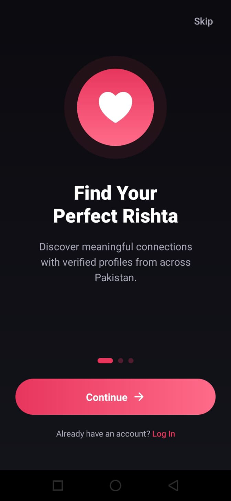
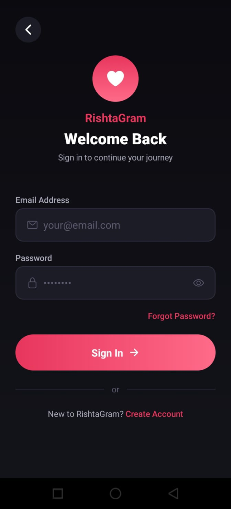
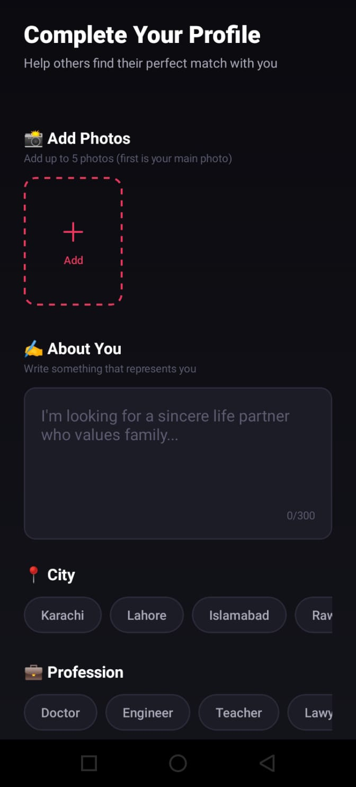
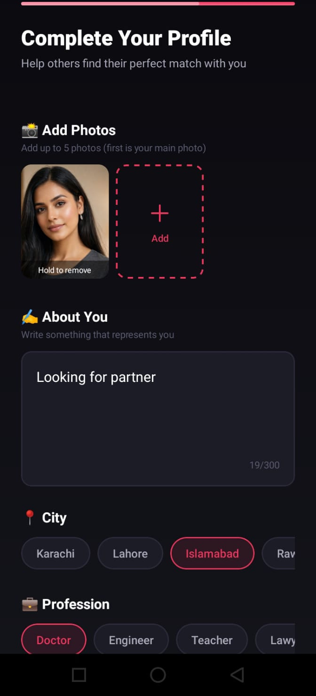
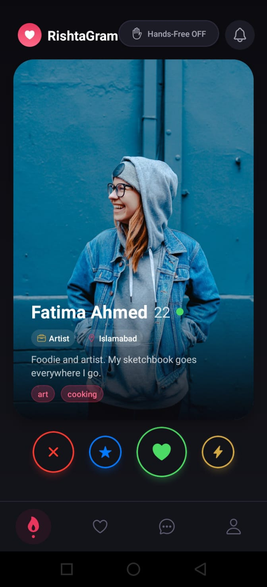
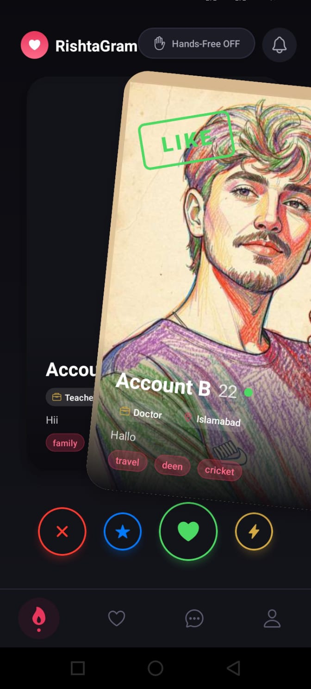
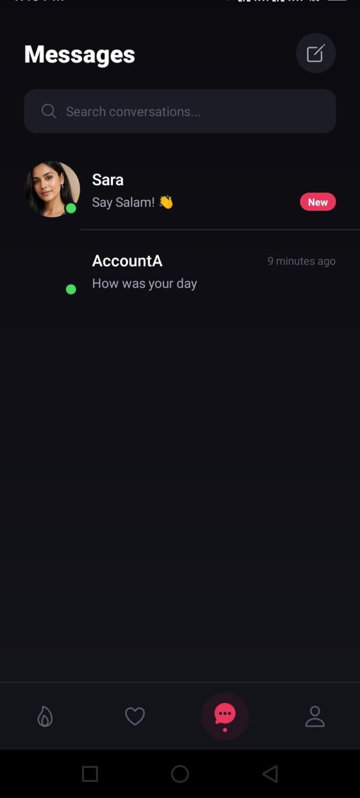
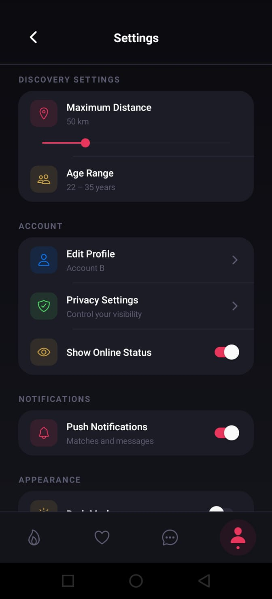
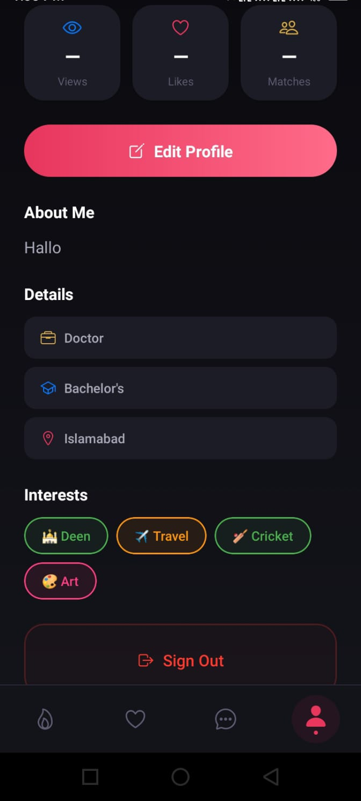

# 💍 RishtaGram

> A modern cross-platform matrimonial mobile application built with **React Native** and **Expo**, designed to provide a secure, intuitive, and engaging matchmaking experience across Android and iOS.

---

## 📱 Overview

RishtaGram is a full-stack mobile application inspired by modern matchmaking platforms. It enables users to create personalized profiles, discover compatible matches through an intuitive swipe-based interface, upload multiple profile photos, and communicate with matched users in real time.

The project demonstrates practical experience in building scalable mobile applications using **React Native**, **Expo**, **Firebase**, **REST APIs**, and modern UI/UX principles.

---

## ✨ Features

### 🔐 Authentication
- Secure User Registration & Login
- Firebase Authentication
- Password Recovery
- Protected User Sessions

### 👤 User Profiles
- Create & Edit User Profile
- Upload Multiple Profile Photos
- Personal Information Management
- Interest & Preference Selection

### ❤️ Match Discovery
- Swipe-Based Match Browsing
- View Detailed User Profiles
- Personalized Recommendations
- Interactive Card Animations

### 💬 Realtime Chat
- One-to-One Messaging
- Realtime Conversation Updates
- Chat History Management

### 📸 Media Management
- Multiple Image Upload
- Image Optimization
- Responsive Gallery Display

### 🎨 User Experience
- Beautiful Dark Theme
- Smooth Animations
- Responsive Layout
- Fast Navigation
- Modern UI Components

### 🔗 Backend Integration
- Firebase Authentication
- Firestore Database
- Firebase Storage
- REST API Integration

---

## 🛠 Tech Stack

### Mobile
- React Native
- Expo
- JavaScript
- TypeScript

### Backend & Database
- Firebase
- Firestore
- Firebase Storage
- REST APIs

### Libraries
- React Navigation
- Redux Toolkit
- Axios
- React Native Reanimated
- React Native Gesture Handler

### Development Tools
- Git
- GitHub
- VS Code

---

## 🏗 Architecture

```
React Native (Expo)
        │
        ▼
 Firebase Authentication
        │
        ▼
 Firestore Database
        │
        ▼
 Firebase Storage
```

The application follows a modular architecture that separates authentication, navigation, reusable UI components, business logic, and backend services to improve scalability, maintainability, and code organization.

---

## 📸 Screenshots

> Replace these images with your actual application screenshots.

### SplashScreen




---
### Authentication




---
### Complete Profile




---

### Home & Discover





---

### Chat




---
### Match Notification


---


### Settings



---
### Edit Your Profile



---

## 🎥 Demo Video

Watch the application in action.


---

## 🚀 Highlights

- Cross-platform Android & iOS Application
- Modern React Native Architecture
- Firebase Authentication & Firestore
- REST API Integration
- Responsive Mobile UI
- Smooth Navigation & Animations
- Secure Cloud Data Storage
- Optimized Image Management
- Reusable Component-Based Design

---

## 💡 Challenges Solved

During development, several real-world engineering challenges were addressed, including:

- Designing a scalable mobile application architecture.
- Building reusable and maintainable UI components.
- Implementing secure authentication.
- Managing realtime user communication.
- Optimizing image uploads and rendering.
- Improving application responsiveness and navigation performance.

---

## 📈 Future Improvements

- Push Notifications
- Video Profiles
- Advanced Search Filters
- AI-Based Match Recommendations
- Premium Membership
- Voice Messaging

---

## 👨‍💻 Developer

**Muhammad Ahmed**

Mobile Application Developer

### Technical Skills

- React Native
- Expo
- JavaScript
- TypeScript
- Firebase
- Redux Toolkit
- REST APIs
- Git & GitHub

---

## 📫 Contact

**GitHub:** https://github.com/Ahmcodez

**Email:** muhammad234204@gmail.com

---

⭐ **If you like this project, consider giving it a Star!**
